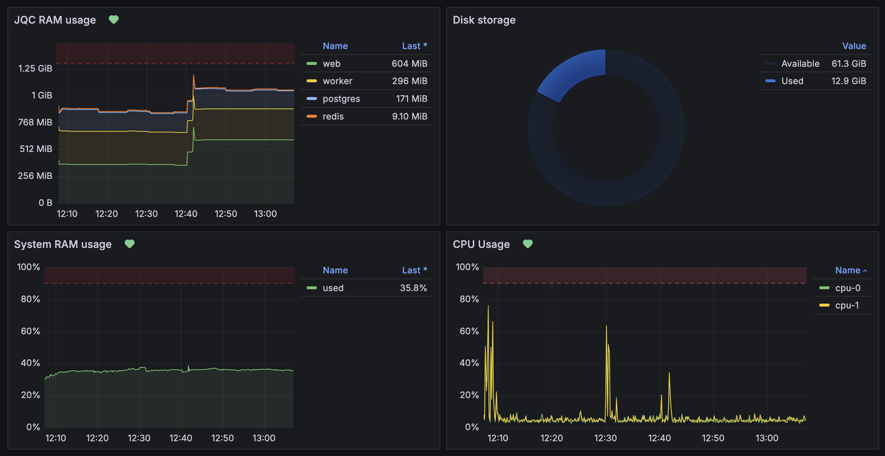

# JQC

[](https://github.com/tom-barone/JQC/blob/master/LICENSE)

[](https://github.com/tom-barone/JQC/actions/workflows/continuous-integration.yml)
[](https://github.com/tom-barone/JQC/actions/workflows/continuous-deployment.yml)
[](https://sonarcloud.io/summary/overall?id=tom-barone_JQC)

[](https://sonarcloud.io/summary/overall?id=tom-barone_JQC)
[](https://sonarcloud.io/summary/overall?id=tom-barone_JQC)
[](https://sonarcloud.io/summary/overall?id=tom-barone_JQC)
[](https://sonarcloud.io/summary/overall?id=tom-barone_JQC)

Rails/PostgreSQL app deployed with Dokku and styled with Bootstrap.

## Getting started

All work is done on the `develop` branch.

After committing and pushing to `develop`, the
[CI Github Action](https://github.com/tom-barone/JQC/actions/workflows/continuous-integration.yml)
will:

1. Run the unit, integration and end to end tests.
1. Deploy a staging site.
1. Run a set of smaller, production safe checks against the staging site.

To deploy a new production version:

1. Do a manual smoke test of the staging site.
1. Create a pull request to merge `develop` -> `master`.
1. Once all checks have passed, the pull request will automatically merge.
1. The [CD Github Action](https://github.com/tom-barone/JQC/actions/workflows/continuous-deployment.yml)
   will deploy a new production version to dokku, run the production safe checks and create a new git release tag.

## Monitoring

If deployed using [tom-barone/web-server-init](https://github.com/tom-barone/web-server-init), there is a [Grafana](https://grafana.com) / [Graphite](https://graphiteapp.org/) instance available at `http://monitoring.<website_domain>` to use.

Definitions for a working Grafana dashboard and set of alerts are included in the `/monitoring` directory.



Alerts:

- Disk storage almost full.
- JQC RAM usage too high.
- System RAM usage too high.
- CPU usage too high.

## Deployment

### Dokku

```bash
# Create the app
ssh -t <user>@<dokku_server> dokku apps:create <website_domain>
# Add the dokku git remote to the repo
git remote add <remote_name> dokku@<dokku_server>:<website_domain>
# Set the domain for the dokku container
dokku --remote <remote_name> domains:set <website_domain>
# Create & link postgres and redis containers (can limit memory usage in MB with --memory)
dokku --remote <remote_name> postgres:create <app_name>-db --memory 1024
dokku --remote <remote_name> postgres:link <app_name>-db <website_domain>
dokku --remote <remote_name> redis:create <app_name>-redis
dokku --remote <remote_name> redis:link <app_name>-redis <website_domain>
# Set important environment variables
dokku --remote <remote_name> config:set RAILS_MASTER_KEY=$(cat config/master.key)
dokku --remote <remote_name> config:set DOMAIN=<website_domain>
# Set on the staging environment
dokku --remote <remote_name> config:set STAGING=true
# Setup LetsEncrypt certs
# - Make sure to have your domain DNS settings point <website_domain> to the server before running this
dokku --remote <remote_name> letsencrypt:enable
# If using a branch other than main or master to deploy from
dokku --remote <remote_name> git:set deploy-branch <branch_name>
# Push the code to the server and deploy
git push <remote_name> <branch>
# Scale up the web and worker processes
dokku --remote <remote_name> ps:scale web=1 worker=1
# Limit the app resources, set these to whatever you need
# See https://docs.docker.com/engine/containers/resource_constraints
dokku --remote <remote_name> resource:limit --memory 1.5g --process-type web
dokku --remote <remote_name> resource:limit --memory 500m --process-type worker
dokku --remote <remote_name> resource:report
# Setup persistent logging to a file at /var/log/dokku/apps/<app_name>.log
# The regular app logs are not kept between container restarts / deploys
dokku --remote <remote_name> logs:set vector-sink "file://?encoding[codec]=csv&encoding[csv][fields][]=timestamp&encoding[csv][fields][]=message&encoding[csv][quote_style]=always&path=/var/log/dokku/apps/<app_name>.log"
dokku --remote <remote_name> logs:vector-start

# Anytime you need to deploy a new release
git push <remote_name> <branch>
```

You can omit the `<remote_name>` and keep it as the default `dokku` remote if you like.
But it's nice if you've got a staging and production servers to have different remotes,
e.g. `staging` and `production`. That way you can deploy to each server with:

```bash
git push staging master
git push production master
```

I like to use `pgAdmin` to interface with the postgres database, which can be done with SSH tunneling.
First you'll need to expose the database port from the docker container to the host machine:

```bash
# Expose the database internally from dokku to 0.0.0.0 on the host
dokku --remote <remote_name> postgres:expose <app_name>-db 5432
# Undo the port expose with
dokku --remote <remote_name> postgres:unexpose <app_name>-db 5432
# View the connection string (password etc.) and use it in pgAdmin, along with relevant SSH tunnel settings
dokku --remote <remote_name> postgres:info <app_name>-db
```

Sometimes it's handy to blast away the database and start fresh:

```bash
dokku --remote <remote_name> postgres:unlink <app_name>-db <website_domain>
dokku --remote <remote_name> postgres:destroy <app_name>-db --force
dokku --remote <remote_name> postgres:create <app_name>-db
dokku --remote <remote_name> postgres:link <app_name>-db <website_domain>
```

To recreate the database from a backup

```bash
# Downloads the most recent backup to ./backup/export
rake fetch_most_recent_backup
# For a local development database
pg_restore --clean --dbname=<local_db_name> --exit-on-error backup/export
# For a dokku hosted database
dokku --remote <remote_name> postgres:import <app_name>-db < backup/export
```

## Development

There are some issues with `solid_queue` causing trouble when resetting the database.
To reset everything from scratch so we can load in backed up data in development:

```bash
rails db:migrate:reset
rails db:drop:queue
# Reset the db/queue_schema.rb file
rails db:prepare
rake restore_development_db_from_most_recent_backup
```
